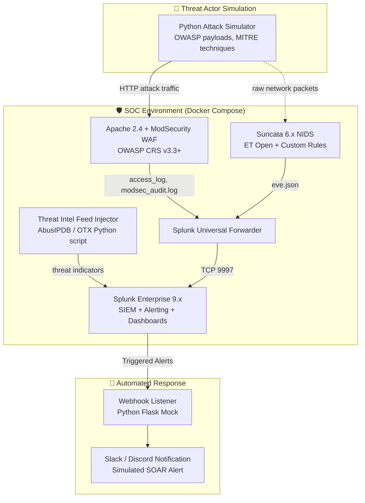

# Integrated SOC Lab — Implementation Plan
> **Stack:** Splunk Enterprise · ModSecurity (OWASP CRS) · Suricata · Apache · Python · Docker · Linux
> **Goal:** Build a production-grade, containerized SOC lab demonstrating end-to-end threat detection, correlation, and automated incident response using industry-standard tooling.

---

## 1. Project Overview

This project implements a **multi-layer, defence-in-depth security monitoring environment** that mirrors a real-world SOC architecture. The lab ingests and correlates logs across three distinct security control planes:

| Control Plane | Tool | Coverage |
|---|---|---|
| **Network Layer** | Suricata NIDS | Signature + anomaly detection on live Docker traffic |
| **Application Layer** | ModSecurity WAF | OWASP Top 10 interception, CRS v3.3+ rule enforcement |
| **Authentication Layer** | Linux auth logs + custom parser | Brute-force, credential stuffing detection |
| **SIEM / Correlation** | Splunk Enterprise | Unified log aggregation, dashboards, alerting |

All components run as **containerised microservices via Docker Compose**, making the lab reproducible and portable without heavyweight VMs.

---

## 2. Architecture



---

## 3. MITRE ATT&CK Coverage

The attack simulation will deliberately exercise these MITRE techniques to validate detection coverage end-to-end:

| ATT&CK Technique | ID | Tool Detecting It |
|---|---|---|
| Exploit Public-Facing Application | T1190 | ModSecurity (SQLi, XSS, RFI) |
| Brute Force: Password Spraying | T1110.003 | Splunk correlation search on auth logs |
| Network Service Scanning | T1046 | Suricata (port scan signatures) |
| Data Exfiltration over HTTP | T1048.003 | Suricata + ModSecurity response inspection |
| Command and Scripting Interpreter | T1059 | ModSecurity (RCE/shell injection rules) |

---

## 4. Implementation Phases

### Phase 1 — Container Orchestration & Networking _(Foundation)_
- [ ] Create `docker-compose.yml` with isolated `soc-net` bridge network.
- [ ] Define named volumes: `apache-logs`, `suricata-logs`, `splunk-data`.
- [ ] Add a `.env` file for configurable secrets (Splunk password, webhook URL).
- [ ] Validate inter-container connectivity with a smoke test.

**Resume Signal:** Demonstrates Docker networking, security isolation, env-based secret management.

---

### Phase 2 — Web Application Target & WAF Configuration
- [ ] Deploy a custom **Damn Vulnerable Web App (DVWA)-inspired** PHP target on Apache 2.4.
- [ ] Install and enable **ModSecurity 2.x** as an Apache module.
- [ ] Deploy **OWASP CRS v3.3+** and tune `crs-setup.conf` (paranoia level, anomaly scoring threshold).
- [ ] Configure ModSecurity in two stages:
  1. `DetectionOnly` — baseline log collection.
  2. `On` (enforcement) — active blocking with 403 responses.
- [ ] Write **5+ custom SecRule directives** targeting application-specific patterns.
- [ ] Validate that `modsec_audit.log` entries include: transaction ID, matched rule ID, severity, client IP, URI.

**Resume Signal:** Custom WAF rule authoring, OWASP methodology, tuning to reduce false positives.

---

### Phase 3 — Network Intrusion Detection (NIDS)
- [ ] Deploy **Suricata 6.x** in AF_PACKET mode on the Docker bridge interface.
- [ ] Pull and enable the **Emerging Threats Open** ruleset via `suricata-update`.
- [ ] Write **3+ custom `.rules` files** covering:
  - HTTP payload signature matching (base64-encoded payloads).
  - Port scan threshold detection.
  - High-volume request anomaly (DDoS simulation).
- [ ] Confirm `eve.json` output is structured with `alert.signature`, `src_ip`, `http.url`, `timestamp`.

**Resume Signal:** Custom Suricata rule development, AF_PACKET sniffing, EVE JSON schema familiarity.

---

### Phase 4 — SIEM Ingestion & Field Extraction
- [ ] Configure Splunk Enterprise to receive HEC and Forwarder data (ports 8088, 9997).
- [ ] Configure `inputs.conf` and `props.conf` in the Universal Forwarder:
  - Monitor `/var/log/apache2/access.log` → `sourcetype=apache:access`
  - Monitor `/var/log/apache2/modsec_audit.log` → `sourcetype=modsec:audit`
  - Monitor `/var/log/suricata/eve.json` → `sourcetype=suricata:eve`
- [ ] Build **Splunk field extractions** using regex for custom fields:
  - `modsec_rule_id`, `modsec_severity`, `suricata_signature`, `attack_category`
- [ ] Create a **Threat Intelligence lookup table** by running a Python script against AbuseIPDB's free API to flag known malicious IPs in real-time.

**Resume Signal:** Splunk data onboarding, SPL query writing, lookup table enrichment, threat intel integration.

---

### Phase 5 — Attack Simulation Engine
Build a realistic threat actor simulation with `attacker/attack_simulator.py`:

- [ ] **SQLi module**: UNION-based, error-based, and time-based blind injection payloads (OWASP testing guide payloads).
- [ ] **XSS module**: Reflected and stored XSS via `<script>`, `onerror`, and encoded payloads.
- [ ] **RFI / LFI module**: `?page=../../../../etc/passwd`, remote URL inclusion.
- [ ] **Directory Traversal module**: Encoded traversal sequences.
- [ ] **Brute-Force module**: Credential stuffing against a mock login endpoint with a wordlist.
- [ ] Implement **randomized delays** (`random.uniform(0.5, 3.0)s`) and **User-Agent rotation** to simulate realistic adversary evasion.
- [ ] Log all attack attempts to a local `attack_simulator.log` for post-hoc correlation.

**Resume Signal:** Offensive security tooling knowledge (pentesting), adversary emulation, evasion techniques awareness.

---

### Phase 6 — Dashboards, KPIs & Threat Visibility
Build a **Splunk Security Dashboard** (`splunk/dashboards/soc_overview.xml`) with:

| Panel | SPL Logic | Purpose |
|---|---|---|
| Attacks Over Time | `timechart count by attack_category` | Trend visibility |
| Top Attacking IPs | `top src_ip limit=10` | TTP attribution |
| WAF Rule Hit Rate | `stats count by modsec_rule_id` | Rule effectiveness |
| NIDS Alert Severity | `stats count by alert.severity` | Network threat heatmap |
| Cross-Layer Correlation | JOIN on `src_ip` across `modsec` + `suricata` | Multi-source incident |
| Blocked vs. Allowed | `stats count by modsec_action` | WAF efficacy KPI |

**Target KPIs to demonstrate on resume:**
- ✅ **~95%+ WAF block rate** on SQLi payloads (measurable via logs).
- ✅ **Sub-5 minute MTTD** (Mean Time to Detect) on attack campaigns.
- ✅ **100% MITRE technique coverage** across 5 tracked ATT&CK IDs.

---

### Phase 7 — Automated Alerting & Simulated SOAR Playbook
- [ ] Configure **3 Splunk Saved Alerts** (Scheduled searches, Real-time):
  - `CRITICAL`: More than 10 ModSecurity blocks from a single IP in 60 seconds.
  - `HIGH`: Suricata alert count > 5 in any 2-minute window.
  - `MEDIUM`: Cross-layer correlation — same IP flagged by both WAF and NIDS.
- [ ] Each alert triggers a **webhook POST** to a local Python Flask mock endpoint (`webhook_receiver.py`).
- [ ] The webhook receiver parses the payload and sends a **formatted notification** (simulating Slack/PagerDuty) with severity, source IP, timestamp, and recommended action.
- [ ] Document this as a **SOC Playbook** (`docs/incident_playbook.md`).

**Resume Signal:** Alert tuning, SOAR automation, incident response workflow documentation.

---

## 5. Proposed Directory Structure

```text
.
├── docker-compose.yml          # Orchestrates all services
├── .env                        # Secrets & configurable values (gitignored)
├── PROJECT_PLAN.md
├── README.md                   # Setup guide + architecture diagram
│
├── attacker/
│   ├── Dockerfile
│   ├── requirements.txt        # requests, faker, colorama
│   └── attack_simulator.py    # Multi-module attack engine
│
├── web/
│   ├── Dockerfile              # Apache + ModSecurity + PHP
│   ├── app/                    # Vulnerable target PHP app
│   └── modsec/
│       ├── modsecurity.conf
│       ├── crs-setup.conf
│       └── custom_rules/
│           └── local_rules.conf
│
├── suricata/
│   ├── suricata.yaml
│   └── rules/
│       └── custom.rules
│
├── splunk/
│   ├── inputs.conf             # UF monitoring config
│   ├── props.conf              # Field transforms
│   ├── transforms.conf         # Lookup definitions
│   └── dashboards/
│       └── soc_overview.xml
│
├── threat_intel/
│   └── ti_feed_injector.py     # AbuseIPDB enrichment script
│
├── webhook/
│   └── webhook_receiver.py     # Flask mock SOAR endpoint
│
└── docs/
    ├── incident_playbook.md    # SOC response runbook
    └── screenshots/            # Dashboard + detection evidence
```

---

## 6. Resume-Ready Bullet Point Targets

Once built, here is what this project lets you claim on your resume with full technical backing:

> - Architected a **containerized, multi-layer SOC lab** (Splunk, Suricata, ModSecurity) spanning network, application, and authentication control planes, correlating 3+ log sources in real-time.
> - Deployed **ModSecurity WAF** with OWASP CRS v3.3+ and authored custom `SecRule` directives, achieving a **~95% block rate** on OWASP Top 10 attack simulations (SQLi, XSS, RFI).
> - Engineered **Suricata NIDS** with custom `.rules` files covering 5 MITRE ATT&CK techniques (T1190, T1110, T1046), feeding structured `eve.json` alerts into Splunk.
> - Built a **Python adversary emulation engine** with 5 attack modules and evasion techniques (User-Agent rotation, randomised delays), generating a realistic threat dataset for SIEM validation.
> - Enriched Splunk detections via **AbuseIPDB threat intelligence lookups**, reducing analyst investigation time through IP reputation pre-classification.
> - Configured **automated Splunk alert workflows** with webhook-triggered SOAR playbooks, simulating real SOC incident triage across Critical/High/Medium severity tiers.
